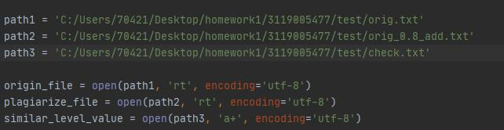
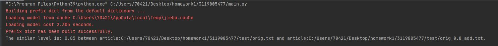

Hi there.


| 这个作业属于哪个课程  |[信安1912-软件工程 (广东工业大学 - 计算机学院)](https://edu.cnblogs.com/campus/gdgy/InformationSecurity1912-Softwareengineering/)|
|--------------------|------------------------------------------------------------------------------------------------------------------------------|
| 这个作业要求在哪里 	  |[个人项目作业](https://edu.cnblogs.com/campus/gdgy/InformationSecurity1912-Softwareengineering/homework/12146)                 |
| 这个作业的目标   	  |1.                                                                                                                           |

# 计划

|PSP2.1						|Personal Software Process Stages	|预估耗时（分钟） 	|实际耗时（分钟） 	|
|:--						|:--								|:--:				|:--:				|
|Planning					|计划								|__820__    		|					|
|· Estimate					|· 估计这个任务需要多少时间			|820   		    	|					|
|Development				|开发								|__560__			|					|
|· Analysis					|· 需求分析 (包括学习新技术)          |420    			|					|
|· Design Spec              |· 生成设计文档					    |60     			|					|
|· Design Review			|· 设计复审					    	|30             	|					|
|· Coding Standard			|· 代码规范 (为目前的开发制定合适的规范)|10		    	|					|
|· Design			    	|· 具体设计       					|60		    		|					|
|· Coding					|· 具体编码  						|300				|					|
|· Code Review				|· 代码复审  						|20		     		|					|
|· Test					    |· 测试（自我测试，修改代码，提交修改） |20 				|					|
|Reporting					|报告    							|__80__				|					|
|· Test Report				|· 测试报告							|20 				|					|
|· Size Measurement			|· 计算工作量						|20 				|					|
|· Postmortem & Process Improvement Plan|· 事后总结, 并提出过程改进计划|40				|					|
|							|· 合计          					|820				|					|


# 开发

## 题目

> 题目：论文查重
>
>描述如下：
>
>设计一个论文查重算法，给出一个原文文件和一个在这份原文上经过了增删改的抄袭版论文的文件，在答案文件中输出其重复率。
>
>原文示例：今天是星期天，天气晴，今天晚上我要去看电影。
>抄袭版示例：今天是周天，天气晴朗，我晚上要去看电影。
>要求输入输出采用文件输入输出，规范如下：
>
>从命令行参数给出：论文原文的文件的绝对路径。
>从命令行参数给出：抄袭版论文的文件的绝对路径。
>从命令行参数给出：输出的答案文件的绝对路径。
>我们提供一份样例，课堂上下发，上传到班级群，使用方法是：orig.txt是原文，其他orig_add.txt等均为抄袭版论文。
>
>注意：答案文件中输出的答案为浮点型，精确到小数点后两位
 

## 需求分析

1. 设计一个论文查重算法

  首先联想到目前学术论文届基本都会用的知网算法，但是知网算法在网络上并没有公开其算法，且其算法会根据段落和目录这些因素来进行查重。
  
  考虑到在密码学中一般来说有一种流程是校验，即校验数据和数字签名是否一样，这其中用到md5算法，这应该是一种hash算法。
  
  而如果收到的数据和原数据有出入，那么得到的哈希值将大相径庭。因此联想到这个方面，查重算法也许可以往hash方向上靠。
  
  后来发现事实上谷歌公司曾提出过一种simhash算法并发表，原论文名为
  _Detecting Near-Duplicates for Web Crawling_, 作者为Gurmeet Singh Manku, Arvind Jain和Anish Das Sarma.
  
  后面会对此算法具体分析说明，于是本项目决定采用simhash算法进行查重。
  
2. 需要用文件进行输入输出，且需要精确到小数点后两位。


### simhash算法

#### Keywords
Hamming distance, near-duplicate, similarity, search, sketch,
fingerprint, web crawl, web document

在引言中，文章提到，关于如何消除网络上爬下来的的相似文章的问题没有被重视。

>A system for detection of near-duplicate pages faces a
>number of challenges. First and foremost is the issue of scale:
>search engines index billions of web-pages; this amounts to
>a multi-terabyte database. Second, the crawl engine should
>be able to crawl billions of web-pages per day. So the decision to mark a newly-crawled page as a near-duplicate of an
>existing page should be made quickly. Finally, the system
>should use as few machines as possible.

引言中提到这样的一个查重系统面临许多挑战。一是文章的规模巨大，互联网上有很多很多文章和页面；二是爬虫引擎能够
在一天之内爬下很多很多页面，这些决定了这个系统必须要快；三是这个系统必须尽可能少地用机器。

文章在第二阶段着重介绍simhash算法，故我们对第二阶段进行翻译和研究。

simhash算法主要有五个阶段
1. 分词，这一步是为了把具体的语句分词之后转化为通用的向量来进行下一步运算。

2. hash，通过hash函数计算每个向量的hash值。

3. 加权，给特征向量加权，得到若干个序列串。

4. 合并，把所有向量相加，即把分出来的词最终转化为一个序列串。

5. 降维，大于0置1，小于0置0，把上面的序列串降维成只有0，1组成的串，形成simhash签名


第三阶段说明了如何得到相似度，此处用到hammer distance即汉明距离。

64位的simhash值，若汉明距离在3以内可认为相似度较高。

汉明距离算法：两个simhash值每一位进行异或，得到1的个数为汉明距离大小。


## 所用到的接口


1. jieba包

这个包主要用于分词。

代码如图：


cut用于分词，analyze用于分析权重。

默认为精确模式。

2. Simhash包

这个包主要是提供一些simhash相关的计算方法。

代码如图：


主要是distance这个方法能直接计算距离，比较方便。


## 类&函数以及其关系

程序用到两个类，四个函数

### SimHash类

包含函数get_string和getHash

get_string函数用于获取原字符串内容,getHash用于获取哈希值并且进行加权，合并，降维操作。

两个函数的关系是：getHash调用了get_string

### PlagiarismChecker类

包含函数analyze\_similar\_text,check\_similar\_level

analyze\_similar\_text函数调用getHash函数并计算海明距离，根据定义来判断文章相似度

check\_similar\_level函数打开命令行给定文件，然后调用analyze\_similar\_text函数计算相似度并保留两位小数

然后存储进一个新文件中输出，并关闭读写释放资源。

# 测试

## 命令行测试

本例中命令行测试方法：python .\main.py 原文件目录 抄袭文件目录 新文件输出目录

如图：


对所有抄袭文件进行测试。


### orig\_0.8_add.txt


相似度为0.85，符合预期

### orig\_0.8_del.txt


相似度为0.79，在0.8左右，符合预期

### orig\_0.8\_dis_1.txt


相似度为0.77，符合预期

### orig\_0.8\_dis_10.txt


相似度也为0.77，符合预期

### orig\_0.8\_dis_15.txt


相似度为0.79，符合预期


### 输出文件check.txt


输出成功，因此命令行测试成功。

## 性能测试

### 时间分析
要进行性能测试首先需要小改代码，让它能够在pycharm里运行

我主要是改动了读写文件的地方，把之前的参数传入改成绝对路径。



测试结果：



可以运行，接下来进行性能测试。


使用pycharm自带的profile功能进行测试


我们按照时间从长到短排序，可以看到时间最长的是check\_similar_level,这个函数里调用了analyze\_similar\_text
函数，而且其时间差不多，说明analyze\_similar\_text函数用时最长；其次，getHash用时也很长，但是考虑到其下面就是cut
时间占其大多数，这说明分词也占了很多时间。


### 改进方法
想到的改进方法是采用更好的分词方法，比如THULAC或者别的。
至于analyze\_similar\_text函数改进思来想去感觉也没啥改进的地方。


## 单元测试
单元测试用到python的unittest

新建一个python文件命名为unit_test.py

为了测试方便，代码需要大改

改动之处：

1：删除PlagiarismChecker类，类下两个函数直接单独定义，方便测试

2：原代码是输出字符串，改动后直接返回结果，否则无法通过断言测试

改动后代码：

```

(自67行起)
def analyze_similar_text(text1, text2):
    new_simash = SimHash()
    first_hash = new_simash.getHash(text1)
    second_hash = new_simash.getHash(text2)

    text_first_hash = Simhash(first_hash)
    text_second_hash = Simhash(second_hash)

    distance = text_first_hash.distance(text_second_hash)
    '''
        .distance is a way in Simhash pack
        '''

    max_hashbit = max(len(bin(text_first_hash.value)), (len(bin(text_second_hash.value))))

    if max_hashbit == 0:
        return 0
    else:
        similar_level = 1 - distance / max_hashbit
        return (similar_level)

    '''
         analyze_similar_text 分析并求出相似度（海明距离）
        '''


def check_similar_level():
    try:

        path1 = input("origin file:")
        path2 = input("plagiarized file:")
        path3 = 'C:/Users/70421/Desktop/homework1/3119005477/test/check.txt'

        origin_file = open(path1, 'rt', encoding='utf-8')
        plagiarize_file = open(path2, 'rt', encoding='utf-8')
        similar_level_value = open(path3, 'a+', encoding='utf-8')

        origin_file_source = origin_file.read()
        plagiarize_file_source = plagiarize_file.read()

        similar = analyze_similar_text(origin_file_source, plagiarize_file_source)
        correct_similar = round(similar, 2)

        str1 = "The similar level is: "
        str2 = " between the two articles.\n"

        similar_level_value.writelines(
            str1 + str(correct_similar) + str2)
        return correct_similar

        origin_file.close()
        plagiarize_file.close()
        similar_level_value.close()
    except IndexError:
        print("Your input is wrong.")
    except FileNotFoundError:
        print("Can't find your files. Please check your files.")
    except Exception as e:
        print(f"Unknown Error:{e}")
    return 0

    '''
        check_similar_level 打开文件，调用analyze_similar_level求出相似度并写入check.txt文件，然后关闭并释放资源
        '''


if __name__ == '__main__':
    check_similar_level()


```


然后编写单元测试模块代码：

```

import unittest
from main import check_similar_level


class MyTestCase(unittest.TestCase):
    def test_something(self):
        self.assertEqual(check_similar_level(), 0.79)


if __name__ == '__main__':
    unittest.main()


```

这里选取的是orig.txt和orig\_0.8\_del.txt两个文件


此处注意到运行后断言值为OK，说明实际上的相似度0.79等于我们设定的预期值。

然后我们单独换一个抄袭文件测试：
orig.txt和orig\_0.8\_dis\_15.txt


这个也正好是0.79，测试通过

再换一个文件：
orig.txt和orig\_0.8\_add.txt


这里就可以看到，我们预期的应该是0.85（对比得出相似度），这不等于我们设定的实际值0.79.


## 代码覆盖率


可以看到主程序main.py覆盖率达到89%，审查代码发现是几个判断处没有覆盖到，这属于正常情况。

至此测试结束。代码回滚到初版（命令行执行版本）

## 异常处理说明
```

        except IndexError:
            print("Your input is wrong.")
        except FileNotFoundError:
            print("Can't find your files. Please check your files.")
        except Exception as e:
            print(f"Unknown Error:{e}")
        return 0

```

1. 如果参数输入错误或者没有输入参数，则程序出现异常，此时应响应并告知用户输入有错误。
2. 如果文件路径错误，那么程序将无法读取文件，出现异常，此时也应告知用户文件路径输入错误。
3. 其余情况则抛出异常。


# 报告

## 计算工作量（PSP表格

|PSP2.1						|Personal Software Process Stages	|预估耗时（分钟） 	|实际耗时（分钟） 	|
|:--						|:--								|:--:				|:--:				|
|Planning					|计划								|__120__    		|__140__			|
|· Estimate					|· 估计这个任务需要多少时间			|120   		    	|140    			|
|Development				|开发								|__560__			|__970__			|
|· Analysis					|· 需求分析 (包括学习新技术)          |420    			|450				|
|· Design Spec              |· 生成设计文档					    |60     			|60 				|
|· Design Review			|· 设计复审					    	|30             	|10 				|
|· Coding Standard			|· 代码规范 (为目前的开发制定合适的规范)|10		    	|10 				|
|· Design			    	|· 具体设计       					|60		    		|30 				|
|· Coding					|· 具体编码  						|300				|360				|
|· Code Review				|· 代码复审  						|20		     		|30 				|
|· Test					    |· 测试（自我测试，修改代码，提交修改） |20 				|20 				|
|Reporting					|报告    							|__80__				|__160__			|
|· Test Report				|· 测试报告							|20 				|120				|
|· Size Measurement			|· 计算工作量						|20 				|10 				|
|· Postmortem & Process Improvement Plan|· 事后总结, 并提出过程改进计划|40				|30 				|
|							|· 合计          					|760				|1270				|


## 总结
1. 在测试时花费太多时间调整错误。
2. 因为一开始编码的结构性问题导致测试时需要对代码进行大型改动。

改进：
1. 在编写代码的时候要注意规范性。
2. 在项目开始前先稳定的规划好每一块的结构和连接关系。

# 参考文献
[simhash](https://www2007.cpsc.ucalgary.ca/papers/paper215.pdf)

https://blog.csdn.net/qq_40938678/article/details/105354002

https://www.kancloud.cn/kancloud/the-art-of-programming/41614


